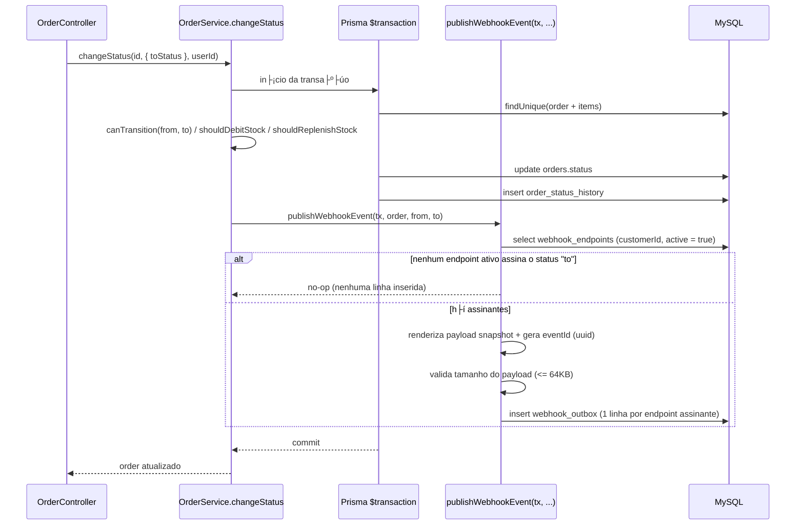
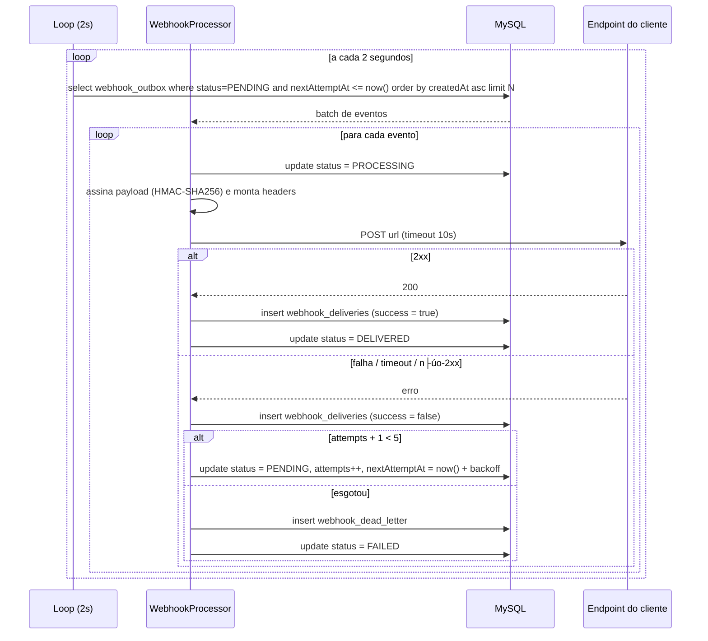

# FDD — Sistema de Webhooks de Notificação de Pedidos

| Campo | Valor |
| --- | --- |
| **Feature** | Sistema de Webhooks de Notificação de Pedidos |
| **Autor** | Larissa (Tech Lead), com Bruno (time de Pedidos) e Diego (time de Plataforma) |
| **Status** | Pronto para implementação |
| **Base** | [RFC](./RFC.md) e [ADRs 001ΓÇô007](./adrs/) |
| **Rastreabilidade** | [TRACKER.md](./TRACKER.md) |
| **Estimativa** | 3 sprints, incluindo revisão de segurança ([09:46] Larissa) |

> Este documento é o "como construir". As decisões e seus porquês estão nos [ADRs](./adrs/); a
> proposta em nível de arquitetura está no [RFC](./RFC.md); o problema de produto está no
> [PRD](./PRD.md).

---

## 1. Contexto e motivação técnica

O OMS atual não possui nenhum mecanismo de notificação externa, evento ou fila. A mudança de status
de um pedido acontece integralmente dentro de `OrderService.changeStatus`
(`src/modules/orders/order.service.ts`), em uma única transação Prisma que:

1. lê o pedido com seus itens;
2. valida a transição contra a máquina de estados de `src/modules/orders/order.status.ts`
   (`canTransition`);
3. debita ou rep├╡e estoque (`shouldDebitStock` / `shouldReplenishStock`);
4. atualiza `orders.status`;
5. insere uma linha em `order_status_history`.

Qualquer notificação externa precisa se ancorar exatamente nesse ponto. Como uma chamada HTTP
síncrona dentro dessa transação travaria mudanças de status de outros pedidos quando um cliente
estivesse lento ([09:04] Bruno), a feature é construída sobre o padrão **Outbox**: o evento é
gravado no banco na mesma transação e entregue depois, de forma assíncrona, por um worker separado
([ADR-001](./adrs/ADR-001-outbox-transacional-no-mysql.md),
[ADR-002](./adrs/ADR-002-worker-separado-com-polling.md)).

---

## 2. Objetivos técnicos

| # | Objetivo |
| --- | --- |
| OT-1 | Garantir atomicidade entre a mudança de status e o registro do evento, sem dual-write ([09:06] Diego) |
| OT-2 | Entregar o evento ao cliente em menos de 10 segundos no caminho feliz, com latência de polling de 2 segundos ([09:02] Marcos, [09:09] Diego) |
| OT-3 | Tolerar indisponibilidade do cliente por até ~15 horas via retry com backoff ([09:17] Diego) |
| OT-4 | Não perder eventos: falha permanente vai para DLQ persistida e reprocessável ([09:18] Diego) |
| OT-5 | Permitir ao cliente verificar autenticidade e integridade do payload via HMAC-SHA256 ([09:20] Sofia) |
| OT-6 | Não introduzir infraestrutura, biblioteca de fila ou padrão de código novo no projeto ([09:07] Diego, [09:30] Larissa) |
| OT-7 | Isolar o ciclo de vida do processamento de eventos do ciclo de vida da API ([09:11] Diego) |

---

## 3. Escopo e exclus├╡es

### 3.1 No escopo

- Modelagem das tabelas `webhook_endpoints`, `webhook_outbox`, `webhook_deliveries` e
  `webhook_dead_letter` + migration Prisma.
- M├│dulo `src/modules/webhooks/` (controller, service, repository, routes, schemas) ([09:27] Bruno).
- Nova entrada de processo para o worker e script `npm run worker` ([09:11] Larissa).
- Publicação do evento dentro da transação de `changeStatus` via `publishWebhookEvent(tx, ...)`
  ([09:41] Bruno).
- Assinatura HMAC-SHA256, geração e rotação de secret com grace period de 24h ([09:21] Sofia).
- CRUD de configuração, histórico de entregas e replay administrativo de DLQ.

### 3.2 Fora do escopo

| Exclusão | Origem |
| --- | --- |
| Webhooks inbound (cliente enviando para n├│s) | [09:02] Marcos |
| Notificação por e-mail quando o webhook do cliente falha | [09:37] Larissa |
| Rate limiting de saída por cliente | [09:39] Larissa |
| Dashboard visual para o cliente | [09:40] Larissa |
| Arquivamento/expurgo das linhas entregues da outbox | [09:08] Diego |
| Escala horizontal do worker (particionamento por `order_id`, lock pessimista) | [09:13] Diego |
| Eventos de outros domínios que não `order.status_changed` | [09:43] Diego |

---

## 4. Modelo de dados

Todas as tabelas seguem as convenções já presentes em `prisma/schema.prisma`: id em UUID
(`@default(uuid()) @db.Char(36)`) ([09:51] Larissa) e nome de tabela em snake_case via `@@map`.

```prisma
enum WebhookOutboxStatus {
  PENDING
  PROCESSING
  FAILED
  DELIVERED
}

model WebhookEndpoint {
  id                     String    @id @default(uuid()) @db.Char(36)
  customerId             String    @db.Char(36)
  url                    String    @db.VarChar(500)
  secret                 String    @db.VarChar(128)
  previousSecret         String?   @db.VarChar(128)
  previousSecretExpiresAt DateTime?
  eventStatuses          Json
  active                 Boolean   @default(true)
  createdAt              DateTime  @default(now())
  updatedAt              DateTime  @updatedAt

  @@index([customerId])
  @@index([active])
  @@map("webhook_endpoints")
}

model WebhookOutbox {
  id            String              @id @default(uuid()) @db.Char(36)
  webhookId     String              @db.Char(36)
  orderId       String              @db.Char(36)
  eventType     String              @db.VarChar(64)
  payload       Json
  status        WebhookOutboxStatus @default(PENDING)
  attempts      Int                 @default(0)
  nextAttemptAt DateTime            @default(now())
  lastError     String?             @db.VarChar(500)
  createdAt     DateTime            @default(now())
  updatedAt     DateTime            @updatedAt

  @@index([status, nextAttemptAt])
  @@index([createdAt])
  @@index([orderId])
  @@map("webhook_outbox")
}

model WebhookDelivery {
  id                 String   @id @default(uuid()) @db.Char(36)
  outboxId           String   @db.Char(36)
  webhookId          String   @db.Char(36)
  attempt            Int
  success            Boolean
  responseStatusCode Int?
  responseBody       String?  @db.Text
  errorCode          String?  @db.VarChar(64)
  durationMs         Int
  attemptedAt        DateTime @default(now())

  @@index([webhookId, attemptedAt])
  @@index([outboxId])
  @@map("webhook_deliveries")
}

model WebhookDeadLetter {
  id           String   @id @default(uuid()) @db.Char(36)
  outboxId     String   @db.Char(36)
  webhookId    String   @db.Char(36)
  eventType    String   @db.VarChar(64)
  payload      Json
  failureReason String  @db.VarChar(500)
  attempts     Int
  replayedAt   DateTime?
  replayedById String?  @db.Char(36)
  createdAt    DateTime @default(now())

  @@index([webhookId])
  @@index([createdAt])
  @@map("webhook_dead_letter")
}
```

Notas de modelagem:

- `WebhookOutbox.id` é também o `event_id` enviado ao cliente. Assim, retry e replay preservam o
  mesmo `X-Event-Id` sem criar um segundo identificador para o mesmo evento ([09:25] Diego).
- Os índices em status e `created_at` da outbox atendem diretamente ao requisito levantado por Diego
  em [09:08] (ler só os pendentes mais antigos em batch pequeno). O índice composto
  `[status, nextAttemptAt]` é a forma prática de suportar também o backoff.
- `payload` guarda o **snapshot renderizado** ([ADR-007](./adrs/ADR-007-payload-snapshot-na-outbox.md)).
- `webhook_deliveries` existe para sustentar o requisito de hist├│rico com sucesso/falha, payload,
  response e tempo de resposta ([09:34] Marcos).
- `previousSecret` + `previousSecretExpiresAt` implementam o grace period de 24h ([09:21] Sofia).

---

## 5. Fluxos detalhados

### 5.1 Criação do evento na outbox (dentro da transação)

Ponto de integração: `OrderService.changeStatus`, em `src/modules/orders/order.service.ts`.



Regras:

1. A inserção acontece **dentro da mesma transação** que atualiza `orders` e `order_status_history`.
   Falha ao inserir na outbox provoca rollback da mudança de status inteira ([09:40] Bruno,
   [09:41] Diego).
2. A assinatura de eventos é filtrada **na inserção**: se nenhum webhook ativo do cliente escuta
   aquele status, nada é inserido ([09:34] Bruno e Diego).
3. Uma linha de outbox é criada **por endpoint assinante**. O `id` UUID da própria linha é também o
  `event_id` enviado em `X-Event-Id`; não existe um segundo identificador de evento. Isso aplica a
  decisão de gerar o UUID quando o evento entra na outbox ([09:25] Diego) sem duplicar identidade
  no modelo.
4. O payload excedendo 64KB gera erro `WEBHOOK_PAYLOAD_TOO_LARGE`; o evento não é enviado
   ([09:23] Sofia, [09:24] Diego/Larissa).
5. Assinatura da função: `publishWebhookEvent(tx, order, fromStatus, toStatus)` — função que recebe o
   client transacional, em vez de injetar o reposit├│rio inteiro no `OrderService` ([09:41] Bruno e
   Diego).

### 5.2 Processamento pelo worker



Detalhes:

- Intervalo de polling: **2 segundos** ([09:09] Diego).
- Ordenação por `created_at` ascendente, o que dá ordenação por pedido enquanto houver um único
  worker ([09:12] Diego).
- Batch pequeno por ciclo ([09:08] Diego).
- Timeout HTTP: **10 segundos**; sem resposta nesse prazo é falha ([09:42] Diego).
- Respostas fora da faixa 2xx são tratadas como falha e entram no ciclo de retry.
- O processo tem sua própria instância de `PrismaClient`, apontando para a mesma `DATABASE_URL`
  ([09:30] Bruno).

**Requisição enviada ao cliente:**

```http
POST /webhooks/oms HTTP/1.1
Host: erp.atlascomercial.com.br
Content-Type: application/json
X-Event-Id: 6f9c3a9e-9a2f-4a1e-9f0e-6c9d1a2b3c4d
X-Webhook-Id: 2b1f5c62-5c0f-4a4a-9a92-6f8e2b7c1d33
X-Signature: sha256=9f86d081884c7d659a2feaa0c55ad015a3bf4f1b2b0b822cd15d6c15b0f00a08
X-Timestamp: 2025-11-18T14:22:31.482Z

{
  "event_id": "6f9c3a9e-9a2f-4a1e-9f0e-6c9d1a2b3c4d",
  "event_type": "order.status_changed",
  "timestamp": "2025-11-18T14:22:29.311Z",
  "order_id": "0f0a6d1a-4b7e-4f2a-9a91-2f7cbe4b1a01",
  "order_number": "ORD-000123",
  "customer_id": "b3b0f0c2-2d2a-4bd1-9c2f-1a3f5d6e7a88",
  "from_status": "PROCESSING",
  "to_status": "SHIPPED",
  "total_cents": 158900
}
```

Campos do payload conforme definido em [09:43] por Diego. **Os itens do pedido não são enviados**
para não inflar o payload; o cliente que precisar de detalhe consulta `GET /api/v1/orders/:id`
([09:43] Diego, [09:44] Bruno).

Headers, conforme [09:44] Diego e [09:44] Sofia:

| Header | Conte├║do |
| --- | --- |
| `Content-Type` | `application/json` |
| `X-Event-Id` | UUID do evento, gerado na inserção na outbox; chave de deduplicação do cliente |
| `X-Signature` | `sha256=<hex>` do HMAC-SHA256 do corpo bruto da requisição, com a secret do endpoint |
| `X-Timestamp` | Timestamp ISO 8601 do envio, para o cliente detectar replay attack se quiser |
| `X-Webhook-Id` | Id do cadastro de webhook, para clientes com m├║ltiplos endpoints |

O formato exato da assinatura durante o grace period não foi definido na reunião. Antes da
implementação, Sofia deve validar se o worker assina com a secret anterior, com a nova, ou publica
duas assinaturas em headers distintos. Até essa definição, o contrato garante apenas que a secret
anterior permanece utilizável por 24 horas ([09:21] Sofia); não prescreve um formato inventado para
`X-Signature`.

### 5.3 Retry e backoff

| Envio | Espera desde a falha anterior | Tempo acumulado aproximado |
| --- | --- | --- |
| Inicial | ΓÇö | 0 |
| Retentativa 1 | 1 minuto | 1 min |
| Retentativa 2 | 5 minutos | 6 min |
| Retentativa 3 | 30 minutos | 36 min |
| Retentativa 4 | 2 horas | 2h36 |
| Retentativa 5 | 12 horas | ~14h36 |
| Fim (DLQ) | Ap├│s falha da retentativa 5 | ~14h36 |

A implementação trata a sequência decidida em [09:17] como **cinco retentativas após o envio
inicial**, pois s├│ assim o intervalo final de 12 horas ocorre antes da ├║ltima tentativa e a janela
total chega a quase 15 horas, como explicado por Diego. O resumo de [09:48] usa "total 5
tentativas"; essa divergência terminológica deve ser confirmada pelos revisores do RFC antes de
codificar, sem remover nenhum dos cinco intervalos registrados na reunião.

`nextAttemptAt` é calculado como `now() + backoff[attempts]`, e o worker só considera elegíveis os
eventos com `nextAttemptAt <= now()`. Cada tentativa gera uma linha em `webhook_deliveries` com
status code, corpo da resposta, código de erro interno e duração em milissegundos.

### 5.4 DLQ e replay

Esgotadas as 5 tentativas, o evento é copiado para `webhook_dead_letter` com payload, motivo da
falha, número de tentativas e timestamp ([09:18] Diego), e a linha da outbox é marcada como `FAILED`.

O replay é **manual**, via `POST /api/v1/admin/webhooks/dead-letter/:id/replay`, que reativa como
pendente a linha original da outbox, preservando seu `id`/`event_id` ([09:18] Diego). O endpoint
exige role `ADMIN` ([09:36] Sofia) e
registra em log quem executou a operação, para auditoria ([09:36] Sofia). A linha da DLQ é marcada
com `replayedAt` e `replayedById` para evitar replay duplicado.

---

## 6. Contratos p├║blicos

Prefixo comum: `/api/v1`, conforme `src/app.ts` (`app.use('/api/v1', buildApiRouter(controllers))`).
Todos os endpoints exigem `Authorization: Bearer <jwt>`, validado por `authenticate`
(`src/middlewares/auth.middleware.ts`). O `customer_id` **não** é extraído do JWT: o token atual
representa o usuário operador, não o cliente, então o cliente é informado no body ou no path
([09:32] Bruno, [09:32] Larissa).

O envelope de erro é o produzido por `src/middlewares/error.middleware.ts`:
`{ "error": { "code": "...", "message": "...", "details": ... } }`.

### 6.1 `POST /api/v1/webhooks` ΓÇö cadastrar webhook

Cadastra um endpoint de webhook para um cliente. A secret é **gerada pela plataforma** e devolvida
na resposta da criação ([09:31] Marcos).

**Request**

```json
{
  "customerId": "b3b0f0c2-2d2a-4bd1-9c2f-1a3f5d6e7a88",
  "url": "https://erp.atlascomercial.com.br/webhooks/oms",
  "eventStatuses": ["SHIPPED", "DELIVERED"]
}
```

**Response `201 Created`**

```json
{
  "id": "2b1f5c62-5c0f-4a4a-9a92-6f8e2b7c1d33",
  "customerId": "b3b0f0c2-2d2a-4bd1-9c2f-1a3f5d6e7a88",
  "url": "https://erp.atlascomercial.com.br/webhooks/oms",
  "eventStatuses": ["SHIPPED", "DELIVERED"],
  "active": true,
  "secret": "whsec_9f2c1d8b7a6e5f4c3b2a1908f7e6d5c4",
  "createdAt": "2025-11-18T14:02:11.004Z"
}
```

| Status | Semântica |
| --- | --- |
| `201` | Webhook criado. **A secret aparece apenas nesta resposta.** |
| `400` | `WEBHOOK_INVALID_URL` (URL não é `https`) ou `VALIDATION_ERROR` (schema Zod) |
| `401` | Token ausente ou inválido |
| `404` | `NOT_FOUND` ΓÇö cliente inexistente |
| `422` | `WEBHOOK_INVALID_EVENT_FILTER` ΓÇö status fora do enum `OrderStatus` |

### 6.2 `GET /api/v1/webhooks?customerId=<uuid>` ΓÇö listar webhooks de um cliente

Listagem paginada, no mesmo formato de `src/shared/http/response.ts` (`paginated`)
([09:33] Bruno).

**Request**

```http
GET /api/v1/webhooks?customerId=b3b0f0c2-2d2a-4bd1-9c2f-1a3f5d6e7a88&page=1&pageSize=20 HTTP/1.1
Authorization: Bearer <jwt>
```

**Response `200 OK`**

```json
{
  "data": [
    {
      "id": "2b1f5c62-5c0f-4a4a-9a92-6f8e2b7c1d33",
      "customerId": "b3b0f0c2-2d2a-4bd1-9c2f-1a3f5d6e7a88",
      "url": "https://erp.atlascomercial.com.br/webhooks/oms",
      "eventStatuses": ["SHIPPED", "DELIVERED"],
      "active": true,
      "createdAt": "2025-11-18T14:02:11.004Z",
      "updatedAt": "2025-11-18T14:02:11.004Z"
    }
  ],
  "pagination": { "page": 1, "pageSize": 20, "total": 1, "totalPages": 1 }
}
```

| Status | Semântica |
| --- | --- |
| `200` | Lista retornada. **A secret nunca é retornada nesta rota.** |
| `400` | `VALIDATION_ERROR` — `customerId` ausente ou não-UUID |
| `401` | Token ausente ou inválido |

### 6.3 `PATCH /api/v1/webhooks/:id` ΓÇö editar webhook

Permite alterar URL, filtro de eventos e estado ativo ([09:33] Bruno).

**Request**

```json
{
  "url": "https://erp.atlascomercial.com.br/webhooks/oms-v2",
  "eventStatuses": ["PAID", "SHIPPED", "DELIVERED"],
  "active": true
}
```

**Response `200 OK`**

```json
{
  "id": "2b1f5c62-5c0f-4a4a-9a92-6f8e2b7c1d33",
  "customerId": "b3b0f0c2-2d2a-4bd1-9c2f-1a3f5d6e7a88",
  "url": "https://erp.atlascomercial.com.br/webhooks/oms-v2",
  "eventStatuses": ["PAID", "SHIPPED", "DELIVERED"],
  "active": true,
  "updatedAt": "2025-11-18T15:10:44.220Z"
}
```

| Status | Semântica |
| --- | --- |
| `200` | Webhook atualizado |
| `400` | `WEBHOOK_INVALID_URL` ou `VALIDATION_ERROR` |
| `401` | Token ausente ou inválido |
| `404` | `WEBHOOK_NOT_FOUND` |
| `422` | `WEBHOOK_INVALID_EVENT_FILTER` |

### 6.4 `DELETE /api/v1/webhooks/:id` ΓÇö remover webhook

**Request**

```http
DELETE /api/v1/webhooks/2b1f5c62-5c0f-4a4a-9a92-6f8e2b7c1d33 HTTP/1.1
Authorization: Bearer <jwt>
```

**Response `204 No Content`** (sem corpo), no mesmo padrão de `OrderController.delete`
(`src/modules/orders/order.controller.ts`).

| Status | Semântica |
| --- | --- |
| `204` | Webhook removido da seleção de novos eventos. O tratamento de eventos já enfileirados depende da decisão aberta QI-1. |
| `401` | Token ausente ou inválido |
| `404` | `WEBHOOK_NOT_FOUND` |

### 6.5 `POST /api/v1/webhooks/:id/secret/rotate` ΓÇö rotacionar secret

Gera uma nova secret e mantém a anterior válida por 24 horas ([09:21] Sofia).

**Request** (sem corpo)

```http
POST /api/v1/webhooks/2b1f5c62-5c0f-4a4a-9a92-6f8e2b7c1d33/secret/rotate HTTP/1.1
Authorization: Bearer <jwt>
```

**Response `200 OK`**

```json
{
  "id": "2b1f5c62-5c0f-4a4a-9a92-6f8e2b7c1d33",
  "secret": "whsec_3a7f10c2e94b5d6a8f1c0b2d3e4f5a67",
  "previousSecretExpiresAt": "2025-11-19T15:22:03.981Z"
}
```

| Status | Semântica |
| --- | --- |
| `200` | Nova secret gerada. A anterior continua aceita até `previousSecretExpiresAt`. |
| `401` | Token ausente ou inválido |
| `404` | `WEBHOOK_NOT_FOUND` |
| `409` | `WEBHOOK_ROTATION_IN_PROGRESS` — já existe uma rotação em grace period |

### 6.6 `GET /api/v1/webhooks/:id/deliveries` ΓÇö hist├│rico de entregas

Retorna as ├║ltimas entregas do webhook com sucesso/falha, payload, resposta e tempo de resposta
([09:34] Marcos). Paginado, com `pageSize` padrão 20 e máximo 100, no mesmo padrão de
`listOrdersQuerySchema` (`src/modules/orders/order.schemas.ts`).

**Request**

```http
GET /api/v1/webhooks/2b1f5c62-5c0f-4a4a-9a92-6f8e2b7c1d33/deliveries?page=1&pageSize=20 HTTP/1.1
Authorization: Bearer <jwt>
```

**Response `200 OK`**

```json
{
  "data": [
    {
      "id": "d1c2b3a4-0011-4a2b-9c8d-7e6f5a4b3c2d",
      "eventId": "a7e2f3b1-8c9d-4e0f-9a1b-2c3d4e5f6071",
      "attempt": 2,
      "success": false,
      "responseStatusCode": 503,
      "responseBody": "{\"error\":\"maintenance\"}",
      "errorCode": "WEBHOOK_DELIVERY_FAILED",
      "durationMs": 812,
      "attemptedAt": "2025-11-18T14:23:31.902Z",
      "payload": {
        "event_id": "6f9c3a9e-9a2f-4a1e-9f0e-6c9d1a2b3c4d",
        "event_type": "order.status_changed",
        "order_number": "ORD-000123",
        "from_status": "PROCESSING",
        "to_status": "SHIPPED"
      }
    }
  ],
  "pagination": { "page": 1, "pageSize": 20, "total": 1, "totalPages": 1 }
}
```

| Status | Semântica |
| --- | --- |
| `200` | Hist├│rico retornado |
| `400` | `VALIDATION_ERROR` — paginação inválida |
| `401` | Token ausente ou inválido |
| `404` | `WEBHOOK_NOT_FOUND` |

### 6.7 `POST /api/v1/admin/webhooks/dead-letter/:id/replay` ΓÇö replay de DLQ

Recoloca o evento morto na outbox como pendente ([09:18] Diego). Exige role `ADMIN`, aplicada com o
`requireRole` já existente em `src/middlewares/auth.middleware.ts` ([09:36] Larissa), e registra em
log quem executou a operação ([09:36] Sofia).

**Request** (sem corpo)

```http
POST /api/v1/admin/webhooks/dead-letter/9e8d7c6b-5a4f-4e3d-2c1b-0a9f8e7d6c5b/replay HTTP/1.1
Authorization: Bearer <jwt-com-role-ADMIN>
```

**Response `202 Accepted`**

```json
{
  "deadLetterId": "9e8d7c6b-5a4f-4e3d-2c1b-0a9f8e7d6c5b",
  "outboxId": "c4d5e6f7-1a2b-4c3d-8e9f-0a1b2c3d4e5f",
  "status": "PENDING",
  "replayedAt": "2025-11-19T09:12:44.512Z",
  "replayedBy": "3f2e1d0c-9b8a-4756-8493-2a1b0c9d8e7f"
}
```

| Status | Semântica |
| --- | --- |
| `202` | Evento recolocado na outbox; a entrega ocorrerá no próximo ciclo do worker |
| `401` | Token ausente ou inválido |
| `403` | `FORBIDDEN` — usuário não tem role `ADMIN` |
| `404` | `WEBHOOK_DEAD_LETTER_NOT_FOUND` |
| `409` | `WEBHOOK_ALREADY_REPLAYED` |

---

## 7. Matriz de erros

Todos os erros do módulo usam o prefixo `WEBHOOK_` ([09:29] Larissa) e são implementados como
classes que estendem as existentes em `src/shared/errors/http-errors.ts`, no mesmo estilo de
`InsufficientStockError` e `InvalidStatusTransitionError` ([09:28] Bruno).

| C├│digo | HTTP | Classe sugerida | Quando ocorre | Onde |
| --- | --- | --- | --- | --- |
| `WEBHOOK_NOT_FOUND` | 404 | `WebhookNotFoundError extends NotFoundError` | Webhook inexistente em GET/PATCH/DELETE/rotate/deliveries | API |
| `WEBHOOK_INVALID_URL` | 400 | `WebhookInvalidUrlError extends ValidationError` | URL não é `https` ou é malformada ([09:23] Sofia) | API (schema Zod) |
| `WEBHOOK_SECRET_REQUIRED` | 400 | `WebhookSecretRequiredError extends ValidationError` | Operação que exige secret sem secret disponível ([09:28] Bruno) | API |
| `WEBHOOK_INVALID_EVENT_FILTER` | 422 | `extends UnprocessableEntityError` | `eventStatuses` contém valor fora de `OrderStatus` ([09:33] Marcos) | API |
| `WEBHOOK_ROTATION_IN_PROGRESS` | 409 | `extends ConflictError` | Rotação solicitada durante grace period ativo ([09:21] Sofia) | API |
| `WEBHOOK_DEAD_LETTER_NOT_FOUND` | 404 | `extends NotFoundError` | Replay de id inexistente na DLQ ([09:35] Diego) | API admin |
| `WEBHOOK_ALREADY_REPLAYED` | 409 | `extends ConflictError` | Replay de evento já reprocessado ([09:18] Diego) | API admin |
| `WEBHOOK_PAYLOAD_TOO_LARGE` | 422 | `extends UnprocessableEntityError` | Payload renderizado excede 64KB ([09:23] Sofia, [09:24] Diego) | Publicação na outbox |
| `WEBHOOK_DELIVERY_TIMEOUT` | — (interno) | `extends AppError` | Cliente não respondeu em 10s ([09:42] Diego) | Worker |
| `WEBHOOK_DELIVERY_FAILED` | ΓÇö (interno) | `extends AppError` | Resposta fora da faixa 2xx ou erro de rede | Worker |
| `WEBHOOK_MAX_ATTEMPTS_EXCEEDED` | — (interno) | `extends AppError` | 5ª retentativa falhou; evento movido para DLQ ([09:17] Larissa) | Worker |

Os códigos marcados como internos não chegam ao cliente HTTP: são gravados em
`webhook_deliveries.errorCode`, em `webhook_dead_letter.failureReason` e no log estruturado. O
middleware `src/middlewares/error.middleware.ts` já serializa qualquer `AppError` no envelope padrão
sem nenhuma alteração ([09:29] Bruno).

---

## 8. Estratégias de resiliência

| Aspecto | Estratégia |
| --- | --- |
| **Timeout** | 10 segundos por tentativa de entrega ([09:42] Diego). Estouro é falha e entra no backoff. |
| **Retry** | Envio inicial seguido de 5 retentativas em 1m / 5m / 30m / 2h / 12h; interpretação pendente de confirmação devido ao resumo de [09:48] ([09:17] Diego). |
| **Isolamento de falha** | Falha de um endpoint não bloqueia os demais: cada linha da outbox é independente e um evento com falha sai do caminho quente (`nextAttemptAt` no futuro). |
| **DLQ** | Ap├│s esgotar as tentativas, o evento vai para `webhook_dead_letter` com payload e motivo ([09:18] Diego), preservando a possibilidade de replay manual. |
| **Atomicidade** | Publicação dentro da transação de `changeStatus`; falha de inserção causa rollback ([09:40] Bruno). |
| **Idempotência** | `X-Event-Id` estável entre tentativas e replays, para deduplicação no cliente ([09:25] Diego). |
| **Payload estável** | Snapshot na inserção: retentativas enviam o mesmo corpo e o mesmo `X-Event-Id`. A assinatura é calculada no envio conforme a secret válida naquele momento ([09:52] Larissa). |
| **Limite de tamanho** | 64KB por payload; acima disso o evento erra em vez de ser truncado ([09:23] Sofia, [09:24] Diego). |
| **Crash do worker** | A garantia at-least-once exige recuperar eventos deixados em `PROCESSING`, mas lease, timeout de recuperação e campos necessários não foram definidos na reunião. Essa lacuna é a decisão aberta QI-2. |
| **Shutdown gracioso** | O worker trata `SIGINT`/`SIGTERM` finalizando o ciclo corrente e chamando `prisma.$disconnect()`, no mesmo padrão de `src/server.ts`. |
| **Sem fallback alternativo de canal** | Notificação por e-mail em caso de falha está fora desta fase ([09:37] Larissa); o fallback operacional é a DLQ com replay manual. |

---

## 9. Observabilidade

Toda a instrumentação usa o Pino já configurado em `src/shared/logger/index.ts`. Nenhuma biblioteca
nova é introduzida ([09:29] Bruno).

### 9.1 Logs

Eventos de log estruturados, seguindo o estilo `snake_case` já usado no projeto
(`http_request`, `server_started`, `shutdown_initiated`):

| Evento | Nível | Campos |
| --- | --- | --- |
| `webhook_event_published` | `info` | `eventId`, `webhookId`, `orderId`, `fromStatus`, `toStatus` |
| `webhook_delivery_attempt` | `info` | `eventId`, `webhookId`, `attempt`, `statusCode`, `durationMs`, `success` |
| `webhook_delivery_failed` | `warn` | `eventId`, `webhookId`, `attempt`, `errorCode`, `nextAttemptAt` |
| `webhook_dead_lettered` | `error` | `eventId`, `webhookId`, `attempts`, `failureReason` |
| `webhook_dead_letter_replayed` | `warn` | `deadLetterId`, `outboxId`, `replayedById` ΓÇö **log de auditoria obrigat├│rio** ([09:36] Sofia) |
| `webhook_secret_rotated` | `warn` | `webhookId`, `previousSecretExpiresAt` |
| `worker_started` / `worker_shutdown` | `info` | `pollIntervalMs`, `signal` |

A lista de `redactPaths` de `src/shared/logger/index.ts` deve ser estendida com os caminhos das
secrets (`*.secret`, `*.previousSecret`) para que nunca apareçam em log — a preocupação vem do caso
real de secret vazada em log de aplicação de cliente ([09:22] Diego).

### 9.2 Métricas

| Métrica | Tipo | Uso |
| --- | --- | --- |
| `webhook_outbox_pending_total` | gauge | Backlog da outbox; crescimento sustentado indica worker parado ou lento |
| `webhook_outbox_oldest_pending_age_seconds` | gauge | Mede diretamente o SLA de "abaixo de 10 segundos" ([09:02] Marcos) |
| `webhook_delivery_total{result}` | counter | Volume de entregas por resultado (sucesso/falha/timeout) |
| `webhook_delivery_duration_ms` | histograma | Latência de resposta dos clientes; base para avaliar o timeout de 10s |
| `webhook_dead_letter_total` | counter | Eventos irrecuperáveis; base para a decisão futura de notificação por e-mail ([09:37] Marcos) |
| `webhook_retry_total{attempt}` | counter | Distribuição de tentativas; valida a política de 5 tentativas ([09:16] Diego) |

### 9.3 Tracing e correlação

Não há APM instalado no projeto hoje, então a correlação é feita por identificadores propagados nos
logs, aproveitando o `requestId` já gerado por `src/middlewares/request-logger.middleware.ts`
(header `X-Request-Id`):

- O `requestId` da requisição `PATCH /orders/:id/status` é persistido junto ao evento da outbox e
  reemitido em todos os logs de entrega, ligando a mudança de status à entrega final.
- O `eventId` (`X-Event-Id`) funciona como trace id de ponta a ponta: aparece na outbox, em cada
  linha de `webhook_deliveries`, na DLQ, nos logs e na requisição recebida pelo cliente.

Caso um APM seja adotado no futuro, `requestId` e `eventId` são os candidatos naturais à correlação
de traces; a reunião não decidiu ferramenta nem formato de tracing.

---

## 10. Integração com o sistema existente

Esta seção nomeia os arquivos reais do repositório afetados pela feature.

### 10.1 `src/modules/orders/order.service.ts`

Ponto de integração crítico. O método `changeStatus` executa hoje um `prisma.$transaction` que
valida a transição via `canTransition`, ajusta estoque, atualiza `orders.status` e insere em
`order_status_history`. A feature acrescenta **uma chamada dentro da mesma transação**, logo após a
criação do histórico e antes da leitura final do pedido:

```ts
await tx.orderStatusHistory.create({ /* ...c├│digo atual... */ });

await publishWebhookEvent(tx, order, from, to);
```

`publishWebhookEvent(tx, order, fromStatus, toStatus)` recebe o `Prisma.TransactionClient` (o alias
`TxClient` já declarado no topo do arquivo), consulta os endpoints ativos do cliente do pedido,
filtra por status assinado e insere as linhas na outbox. Se essa chamada lançar, o `$transaction`
faz rollback e a mudança de status não acontece ([09:40] Bruno, [09:41] Diego). A função é exportada
pelo m├│dulo de webhooks, evitando injetar o reposit├│rio inteiro no `OrderService` ([09:41] Diego).

### 10.2 `src/shared/errors/http-errors.ts` e `src/shared/errors/app-error.ts`

As classes de erro do m├│dulo estendem as existentes, exatamente como `InsufficientStockError`
estende `UnprocessableEntityError` e `InvalidStatusTransitionError` estende `ConflictError`. A base
`AppError` já carrega `statusCode`, `errorCode` e `details`, que é tudo o que a matriz de erros da
seção 7 precisa. Os novos erros são exportados pelo barrel `src/shared/errors/index.ts`, mantendo o
import ├║nico usado nos demais services ([09:28] Bruno).

### 10.3 `src/middlewares/auth.middleware.ts`

`authenticate` protege todas as rotas do m├│dulo, no mesmo formato de
`src/modules/orders/order.routes.ts` (`router.use(authenticate)`). O endpoint de replay de DLQ usa
`requireRole('ADMIN')`, o mesmo helper já existente, e o `req.user.id` disponibilizado pelo
middleware é o valor gravado em `webhook_dead_letter.replayedById` e no log de auditoria
([09:36] Larissa e Sofia).

### 10.4 `src/middlewares/error.middleware.ts`

Nenhuma alteração necessária. O middleware já converte qualquer `AppError` no envelope
`{ error: { code, message, details } }`, trata `ZodError` como `VALIDATION_ERROR` e mapeia erros
conhecidos do Prisma. Os erros `WEBHOOK_*` são absorvidos automaticamente ([09:29] Bruno).

### 10.5 `src/middlewares/validate.middleware.ts` e schemas Zod

`webhook.schemas.ts` segue o formato de `src/modules/orders/order.schemas.ts`: schemas de params,
body e query aplicados via `validate({ params, body, query })`. A validação de TLS obrigatório é
implementada aqui como um refinamento de schema (`z.string().url().startsWith('https://')`), e não
como componente arquitetural ([09:23] Sofia). O filtro de eventos usa `z.nativeEnum(OrderStatus)`,
reaproveitando o enum do Prisma.

### 10.6 `src/app.ts` e `src/routes/index.ts`

`buildControllers` instancia `WebhookRepository` → `WebhookService` → `WebhookController` no mesmo
padrão dos demais módulos, o tipo `Controllers` ganha a chave `webhooks`, e `buildApiRouter` registra
`router.use('/webhooks', buildWebhookRouter(controllers.webhooks))` e a rota administrativa sob
`/admin/webhooks`.

### 10.7 `src/server.ts` → nova entrada de worker

O worker é uma entrada de processo separada, espelhando a estrutura de `bootstrap()` em
`src/server.ts`: carrega `env`, cria o `PrismaClient`, inicia o loop de polling e trata
`SIGINT`/`SIGTERM` com `prisma.$disconnect()`. A diferença é que não sobe servidor HTTP
([09:11] Larissa, [09:11] Diego). O `PrismaClient` é uma instância própria, pois o client é por
processo ([09:30] Bruno).

### 10.8 `prisma/schema.prisma` e `src/config/database.ts`

Os quatro modelos da seção 4 são adicionados ao schema, seguindo as convenções existentes
(`@db.Char(36)`, `@@map` em snake_case, índices explícitos). A definição de relações Prisma e de
chaves estrangeiras deve acompanhar a decisão de retenção dos endpoints (QI-1); o trecho acima
mostra apenas os campos mínimos derivados da reunião. O worker usa `createPrismaClient()` de
`src/config/database.ts` para obter sua própria instância ([09:30] Bruno).

### 10.9 `src/config/env.ts` e `package.json`

`env.ts` deve validar as configurações operacionais do worker. `package.json` ganha o script
`npm run worker`, conforme decidido em [09:11] Larissa. O comando exato de desenvolvimento e
produção deve seguir os scripts existentes e ser fechado na implementação, sem fixar neste FDD uma
forma que não foi decidida na reunião.

### 10.10 `src/shared/http/response.ts` e `src/shared/logger/index.ts`

`paginated()` é reutilizado nas listagens de webhooks e de entregas. O logger Pino é o mesmo, com
`redactPaths` estendido para os campos de secret (seção 9.1).

---

## 11. Dependências e compatibilidade

| Item | Situação |
| --- | --- |
| MySQL 8.0 (`docker-compose.yml`) | Já existe; ganha 4 tabelas novas |
| Prisma 5.22 (`@prisma/client`) | Já existe; nova migration |
| Express 4.21, Zod 3.23, Pino 9.5, `uuid` 11 | Já existem; usados sem alteração de versão |
| Cliente HTTP no worker | Deve suportar timeout de 10 segundos ([09:42] Diego). A biblioteca ou API concreta não foi definida na reunião. |
| HMAC-SHA256 | `node:crypto` nativo; nenhuma dependência nova ([09:20] Sofia) |
| Compatibilidade de API | Aditiva. Nenhum endpoint existente muda de contrato. |
| Compatibilidade de dados | Novas tabelas são necessárias; relações e chaves estrangeiras dependem da decisão QI-1. |
| Deploy | Passa a exigir **dois processos**: `npm start` (API) e `npm run worker` ([09:11] Diego) |
| Ordem de deploy | Deve garantir que o schema da outbox exista antes de API e worker utilizarem-no; a estratégia operacional não foi discutida na reunião. |

---

## 12. Critérios de aceite técnicos

| # | Critério |
| --- | --- |
| CAT-1 | Rollback da transação de `changeStatus` não deixa linha órfã na `webhook_outbox`, e falha na inserção da outbox impede a mudança de status ([09:40] Bruno) |
| CAT-2 | Mudança de status sem nenhum endpoint ativo assinando aquele status não insere linha na outbox ([09:34] Bruno) |
| CAT-3 | O worker inicia a primeira tentativa em até 2 segundos após o commit, no caminho feliz; a entrega completa permanece sujeita ao objetivo de produto de menos de 10 segundos ([09:02] Marcos, [09:09] Diego) |
| CAT-4 | Entrega inclui os headers `X-Event-Id`, `X-Signature`, `X-Timestamp` e `X-Webhook-Id`, e `Content-Type: application/json` ([09:44] Diego e Sofia) |
| CAT-5 | `X-Signature` valida como HMAC-SHA256 do corpo bruto com a secret do endpoint ([09:20] Sofia) |
| CAT-6 | Após rotação, assinaturas geradas com a secret antiga continuam aceitas por 24 horas e deixam de ser aceitas depois ([09:21] Sofia) |
| CAT-7 | Cadastro com URL `http` é rejeitado com `WEBHOOK_INVALID_URL` e status 400 ([09:23] Sofia) |
| CAT-8 | Cliente respondendo com atraso superior a 10 segundos é tratado como falha ([09:42] Diego) |
| CAT-9 | Ap├│s a falha do envio inicial e das cinco retentativas, o evento aparece em `webhook_dead_letter` com payload e motivo, e sai da varredura de pendentes ([09:17] e [09:18] Diego) |
| CAT-10 | As cinco retentativas respeitam os intervalos 1m / 5m / 30m / 2h / 12h ([09:17] Diego) |
| CAT-11 | Replay de DLQ com usuário `OPERATOR` retorna 403; com `ADMIN` retorna 202 e gera log de auditoria com o id do usuário ([09:36] Sofia e Larissa) |
| CAT-12 | Payload acima de 64KB não é enviado e gera `WEBHOOK_PAYLOAD_TOO_LARGE` ([09:24] Larissa) |
| CAT-13 | O `X-Event-Id` é idêntico em todas as tentativas e no replay do mesmo evento ([09:25] Diego) |
| CAT-14 | O payload entregue reflete o estado do pedido no instante da transição, mesmo que o pedido tenha mudado depois ([09:52] Larissa) |
| CAT-15 | Nenhuma secret aparece em log, nem em `GET /webhooks` ([09:22] Diego) |
| CAT-16 | Reinício da API não interrompe o processamento de eventos ([09:11] Diego) |
| CAT-17 | Suíte existente em `tests/orders.test.ts` continua verde após a alteração no `changeStatus` |

### 12.1 Estratégia de testes

Vitest + Supertest, no mesmo formato de `tests/orders.test.ts`, com o reset de banco de
`tests/setup.ts` estendido para as novas tabelas e as fábricas de `tests/helpers/factories.ts`
ampliadas com um `createWebhookEndpoint`.

- **Unitários:** cálculo de backoff, geração e verificação de HMAC, validação de schema (URL `https`,
  filtro de status), limite de 64KB.
- **Integração:** publicação na outbox dentro da transação (inclusive o caso de rollback), CRUD dos
  endpoints, hist├│rico de entregas, replay de DLQ com e sem role `ADMIN`.
- **Worker:** entrega bem-sucedida, timeout de 10s, escalonamento de tentativas até a DLQ, e
  estabilidade do `X-Event-Id` entre tentativas ΓÇö com um servidor HTTP local simulando o cliente.

---

## 13. Riscos e mitigação

| Risco | Probabilidade | Impacto | Mitigação |
| --- | --- | --- | --- |
| A escrita extra na transação de `changeStatus` degrada o fluxo mais crítico do OMS | Média | Alto | Payload renderizado em memória antes da escrita; consulta de assinantes indexada por `customerId`+`active`; batch de inserts único; medir `changeStatus` antes e depois |
| Cliente lento segura o worker single-threaded e atrasa a fila inteira | Média | Alto | Timeout de 10s ([09:42] Diego); evento com falha sai do caminho quente via `nextAttemptAt`; métrica `webhook_outbox_oldest_pending_age_seconds` como alarme |
| Cliente sem deduplicação processa evento duplicado | Alta | Médio | `X-Event-Id` em todas as tentativas ([09:25] Diego) e documentação destacada no portal ([09:26] Marcos) |
| Crescimento indefinido da outbox degrada o polling | Média | Médio | Índices em `status`/`createdAt` ([09:08] Diego); arquivamento definido como trabalho posterior ([09:08] Diego) |
| Secret vazada no lado do cliente | Baixa | Alto | Secret por endpoint ([09:21] Sofia); rotação com grace period; redaction no logger; revisão de segurança de 2 dias antes do deploy ([09:46] Sofia) |
| Eventos presos em `PROCESSING` após crash do worker | Baixa | Médio | Reelegibilidade por idade em `PROCESSING`; duplicidade coberta pela garantia at-least-once ([09:24] Diego) |
| Rajada de mudanças de status bombardeia o endpoint do cliente | Média | Médio | Sem mitigação nesta fase por decisão explícita: observar e implementar rate limiting se virar problema ([09:39] Diego e Larissa) |

---

## 14. Decisões de implementação em aberto

| ID | Questão | Por que bloqueia |
| --- | --- | --- |
| QI-1 | Ao remover um webhook, eventos já enfileirados são descartados, entregues com a configuração preservada ou enviados para DLQ? A reunião decidiu o endpoint `DELETE`, mas não o ciclo de vida das pendências ([09:33] Bruno). | Define soft delete versus hard delete, relações do Prisma e disponibilidade de URL/secret para eventos antigos. |
| QI-2 | Como recuperar eventos deixados em `PROCESSING` após crash: lease temporal, retorno imediato a `PENDING` ou outra estratégia? | Sem essa decisão, o worker pode perder eventos ou duplicá-los; at-least-once exige recuperação ([09:24] Diego). |
| QI-3 | Durante as 24 horas de grace period, qual secret assina novas entregas e como o cliente recebe uma ou mais assinaturas? | A reunião decidiu duas secrets válidas em paralelo, mas não o formato do header nem a regra para eventos enfileirados ([09:21] Sofia). |
| QI-4 | "5 tentativas" significa cinco envios totais ou cinco retentativas depois do envio inicial? | A sequência decidida contém cinco intervalos e chega a quase 15 horas, enquanto o resumo usa "total 5 tentativas" ([09:17] Diego, [09:48] Larissa). |
| QI-5 | Uma mudança de status com vários endpoints assinantes gera um único `event_id` compartilhado ou um evento de entrega por endpoint? | A reunião definiu UUID único por evento e filtro por endpoint, mas não a granularidade do fan-out ([09:25] Diego, [09:34] Bruno). Isso define se `WebhookOutbox.id` pode ser o `event_id` sem uma tabela lógica adicional. |
