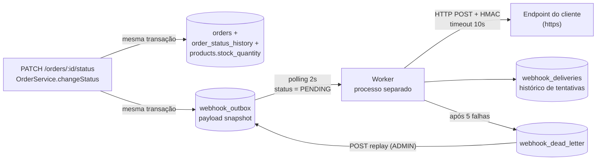

# RFC — Sistema de Webhooks de Notificação de Pedidos

| Campo | Valor |
| --- | --- |
| **Título** | Sistema de Webhooks de Notificação de Pedidos |
| **Autor** | Larissa (Tech Lead) |
| **Status** | Em revisão |
| **Data** | Quinta-feira da reunião técnica (`TRANSCRICAO.md`, 09:00–09:53) |
| **Revisores** | Marcos (Product Manager), Bruno (Engenheiro Pleno — time de Pedidos), Diego (Engenheiro Sênior — time de Plataforma), Sofia (Engenheira de Segurança) |
| **Documentos relacionados** | [PRD](./PRD.md), [FDD](./FDD.md), [ADRs](./adrs/), [Tracker](./TRACKER.md) |
| **Prazo alvo** | 3 sprints, incluindo a revisão de segurança ([09:46] Larissa) |

> Este RFC apresenta a proposta técnica em nível de arquitetura e as questões ainda em aberto.
> O detalhamento de implementação (contratos, matriz de erros, integração linha a linha com o
> código) está no [FDD](./FDD.md). As decisões fechadas estão registradas individualmente nos
> [ADRs](./adrs/).

---

## 1. TL;DR

Propomos entregar notificações outbound de mudança de status de pedido usando o **padrão Outbox
sobre o MySQL existente**. A inserção do evento acontece dentro da mesma transação do
`changeStatus`, garantindo atomicidade. Um **worker em processo separado** faz polling da outbox a
cada 2 segundos e executa as chamadas HTTP, com **timeout de 10s**, **backoff
1m/5m/30m/2h/12h** e **DLQ em tabela dedicada** com replay manual restrito a `ADMIN`. A reunião
deixou uma ambiguidade entre cinco envios totais e cinco retentativas, registrada como questão em
aberto antes da implementação.
A autenticidade é garantida por **HMAC-SHA256 com secret única por endpoint**, rotacionável com
grace period de 24h, sobre URLs obrigatoriamente `https`. A garantia de entrega é **at-least-once**,
com deduplicação delegada ao cliente via header `X-Event-Id`.

Nenhuma infraestrutura nova é introduzida: MySQL, Prisma, Express, Zod e Pino já existem no projeto.

---

## 2. Contexto e problema

Três clientes B2B — Atlas Comercial, MaxDistribuição e Nova Cargo — pediram formalmente para serem
notificados quando o status dos pedidos deles muda ([09:00] Marcos). Hoje eles fazem polling em
`GET /orders`, o que torna a integração lenta e cara do lado deles. A Atlas sinalizou risco de
migração para um concorrente caso a entrega não aconteça até o fim do trimestre ([09:00] Marcos).

A plataforma não tem hoje nenhum mecanismo de notificação externa, evento ou fila. O ciclo de vida
do pedido é controlado por máquina de estados em `src/modules/orders/order.status.ts`, e a mudança
de status é executada dentro de uma transação Prisma em `src/modules/orders/order.service.ts`, que
já atualiza `orders`, insere em `order_status_history` e ajusta `stock_quantity`.

Restrições relevantes levantadas na reunião:

- **Latência aceitável:** qualquer coisa abaixo de 10 segundos é considerada "tempo real" pelos
  clientes ([09:02] Marcos).
- **Direção única:** apenas outbound; os clientes recebem, não enviam ([09:02] Marcos, [09:03] Sofia).
- **A transação de status não pode ser comprometida:** acrescentar chamada HTTP síncrona ali
  travaria mudanças de status de outros pedidos quando um cliente estiver lento ([09:04] Bruno).
- **Time pequeno:** subir infraestrutura nova para essa feature seria overengineering ([09:07] Diego).

---

## 3. Proposta técnica

### 3.1 Visão geral

### 3.2 Componentes propostos

| Componente | Responsabilidade | ADR |
| --- | --- | --- |
| Tabela `webhook_outbox` | Fila persistente de eventos, escrita na mesma transação da mudança de status | [ADR-001](./adrs/ADR-001-outbox-transacional-no-mysql.md) |
| Worker em processo separado | Consome a outbox por polling de 2s e entrega via HTTP | [ADR-002](./adrs/ADR-002-worker-separado-com-polling.md) |
| Política de retry + `webhook_dead_letter` | Backoff nos cinco intervalos decididos e destino final de eventos irrecuperáveis; contagem de envios pendente | [ADR-003](./adrs/ADR-003-retry-backoff-e-dlq.md) |
| Assinatura HMAC-SHA256 | Autenticidade e integridade do payload, com secret por endpoint e rotação | [ADR-004](./adrs/ADR-004-hmac-sha256-secret-por-endpoint.md) |
| Header `X-Event-Id` | Chave de deduplicação no cliente sob garantia at-least-once | [ADR-005](./adrs/ADR-005-at-least-once-com-x-event-id.md) |
| Módulo `src/modules/webhooks/` | CRUD de configuração, histórico de entregas e replay administrativo | [ADR-006](./adrs/ADR-006-reuso-dos-padroes-existentes.md) |
| Payload snapshot | Evento carrega o estado do pedido no instante da transição | [ADR-007](./adrs/ADR-007-payload-snapshot-na-outbox.md) |

### 3.3 Escolhas centrais e por quê

**Outbox transacional em vez de disparo síncrono ou broker.** Se a transação commitou, o evento
existe; se deu rollback, o evento some junto ([09:06] Diego). Isso elimina a classe inteira de bugs
de dual-write sem introduzir Redis ou qualquer broker ([09:07] Diego).

**Polling a cada 2 segundos.** O MySQL não tem equivalente ao `NOTIFY`/`LISTEN` do Postgres, e
triggers não notificam processos externos ([09:09] Diego). Polling de 2s cabe folgadamente no
orçamento de 10 segundos do requisito de produto.

**Worker como processo separado.** Evita que restart ou deploy da API interrompa o processamento de
eventos ([09:11] Diego). Mesmo banco e mesma stack, `PrismaClient` próprio por ser um processo Node
distinto ([09:30] Bruno).

**Filtro de assinatura aplicado na inserção.** Se nenhum webhook ativo do cliente escuta aquele
status, a linha nem entra na outbox ([09:34] Bruno/Diego).

**Reuso integral dos padrões da codebase.** `AppError`, error middleware, schemas Zod, Pino,
estrutura de módulo e `requireRole` são reaproveitados sem alteração estrutural ([09:30] Larissa).
Códigos de erro do módulo usam o prefixo `WEBHOOK_` ([09:29] Larissa).

### 3.4 Superfície de API proposta

Endpoints de configuração autenticados com JWT comum; o `customer_id` **não** vem do token, porque
o JWT atual representa o usuário operador e não o cliente ([09:32] Bruno/Larissa).

- `POST` de cadastro de webhook (secret gerada pela plataforma e devolvida na criação)
- `GET` de listagem dos webhooks de um cliente
- `PATCH` de edição e `DELETE` de remoção ([09:33] Bruno)
- `POST` de rotação de secret, com grace period de 24h ([09:21] Sofia)
- `GET` de histórico de entregas por webhook ([09:34] Marcos)
- `POST /admin/webhooks/dead-letter/:id/replay`, restrito a role `ADMIN` e com log de auditoria
  ([09:35] Diego, [09:36] Sofia/Larissa)

Contratos completos, payloads de exemplo e status codes estão no [FDD](./FDD.md).

---

## 4. Alternativas consideradas

### 4.1 Disparo HTTP síncrono dentro de `changeStatus`

**Trade-off que motivou o descarte:** a transação de mudança de status já é pesada (atualiza pedido,
insere histórico e movimenta estoque). Uma chamada HTTP dentro dela faria um cliente lento travar a
mudança de status de outros pedidos, e não haveria resposta razoável para cliente fora do ar — dar
rollback na mudança de status por causa de notificação não é aceitável ([09:04] Bruno). Descartado
sem contestação: "síncrono está fora de questão" ([09:06] Diego).

### 4.2 Redis Streams (ou broker equivalente) como fila de eventos

**Trade-off que motivou o descarte:** melhor desacoplamento e throughput, mas exige subir e operar
infraestrutura nova. "A gente é um time pequeno. Subir Redis Cluster pra isso é overengineering.
Outbox no MySQL existente resolve" ([09:07] Diego), complementando a observação de Larissa de que a
alternativa obrigaria o time a "subir mais infra" ([09:07]).

### 4.3 Trigger de banco para notificar o worker

**Trade-off que motivou o descarte:** seria mais reativo que polling, mas o MySQL não tem listener
nativo; a trigger só executa SQL e avisar um processo externo exigiria improviso, como escrever em
arquivo ou bater em um endpoint ([09:09] Diego). Complexidade sem ganho perceptível diante do SLA de
10 segundos.

### 4.4 Política de retry com 3 tentativas

**Trade-off que motivou o descarte:** mais agressiva e libera a fila mais cedo ([09:16] Bruno), mas
cobre apenas cerca de 30 minutos de indisponibilidade. O time já teve cliente com duas horas de
manutenção planejada ([09:16] Diego). Fechado em 5 tentativas.

### 4.5 Garantia exactly-once

**Trade-off que motivou o descarte:** dispensaria deduplicação no cliente, mas exigiria coordenação
entre as duas pontas e aumentaria muito a complexidade. "At-least-once com event_id resolve 99% dos
casos" ([09:25] Diego), seguindo o precedente de Stripe e GitHub.

### 4.6 DLQ como marcação `failed` na própria outbox

**Trade-off que motivou o descarte:** economiza uma tabela, mas mistura eventos vivos e mortos na
varredura do worker. Tabela dedicada "mais limpa a leitura da outbox principal, e fica como evidence
pra debug e reprocessamento" ([09:18] Diego).

---

## 5. Questões em aberto

| # | Questão | Situação | Origem |
| --- | --- | --- | --- |
| Q1 | **Rate limiting de saída.** Se um cliente tiver 50 pedidos mudando de status em um minuto, disparamos 50 chamadas contra ele. Precisamos limitar? | Fora do escopo desta fase. Decisão: observar em produção e implementar se virar problema real ([09:39] Diego e Larissa). | [09:38] Diego |
| Q2 | **Notificação ao cliente sobre webhook com falha (e-mail após falhas consecutivas).** | Adiado. "Email tá fora de escopo dessa fase. Talvez próxima fase, depois que a gente medir o impacto" ([09:37] Larissa). Registrado como futuro por Marcos ([09:38]). | [09:37] Marcos |
| Q3 | **Estratégia de escala para múltiplos workers.** Com mais de um worker, perde-se a ordenação por `order_id`; as saídas cogitadas foram particionar por `order_id` ou usar lock pessimista. | Não decidido. "Isso é problema do futuro, não agora" ([09:13] Diego). Fica como limitação conhecida ([09:13] Larissa). | [09:12] Diego |
| Q4 | **Arquivamento das linhas entregues da outbox** (ordem de 30 dias). | Mencionado como necessário, mas explicitamente fora do escopo desta feature ([09:08] Diego). | [09:08] Diego |
| Q5 | **Endurecimento de permissão no CRUD de configuração.** Hoje qualquer role autenticada pode gerenciar webhooks. | Aceito por ora: "Por enquanto sim. Mais pra frente a gente pode endurecer" ([09:37] Sofia). | [09:37] Sofia |
| Q6 | **Contagem da política de retry.** Os cinco intervalos implicam cinco retentativas após o envio inicial, mas o resumo diz "total 5 tentativas". | Precisa de confirmação de Larissa e Diego antes da implementação. | [09:17] Diego, [09:48] Larissa |
| Q7 | **Protocolo de assinatura durante a rotação.** Qual secret assina novas entregas e como múltiplas assinaturas seriam representadas? | O grace period de 24h foi decidido; o protocolo de header não foi. Requer aprovação de Sofia. | [09:21] Sofia |
| Q8 | **Remoção de endpoint com eventos pendentes.** Excluir, entregar ou mover as pendências para DLQ? | O CRUD foi decidido, mas o ciclo de vida das pendências não foi discutido. | [09:33] Bruno |
| Q9 | **Recuperação após crash em `PROCESSING`.** Qual mecanismo torna o evento elegível novamente? | Necessário para operacionalizar at-least-once; lease e timeout não foram discutidos. | [09:24] Diego |
| Q10 | **Granularidade do `event_id` no fan-out.** Uma transição compartilhada por vários endpoints usa um UUID ou um UUID por entrega? | A reunião definiu unicidade do evento e filtro por endpoint, mas não relacionou os dois conceitos. | [09:25] Diego, [09:34] Bruno |

---

## 6. Impacto e riscos

### 6.1 Impacto no sistema existente

| Área | Impacto |
| --- | --- |
| `src/modules/orders/order.service.ts` | `changeStatus` passa a chamar `publishWebhookEvent(tx, order, fromStatus, toStatus)` dentro do `$transaction` ([09:41] Bruno). Falha na inserção do evento causa rollback da mudança de status ([09:40] Bruno). |
| `prisma/schema.prisma` | Modelos novos e uma migration. Nenhuma tabela existente é alterada. |
| `src/app.ts` e `src/routes/index.ts` | Registro do novo módulo e do novo router sob `/api/v1`. |
| `src/middlewares/error.middleware.ts` | Nenhuma alteração: já trata `AppError`, `ZodError` e erros do Prisma ([09:29] Bruno). |
| Operação | Um novo processo (`npm run worker`) a implantar e monitorar ([09:11] Larissa). |

### 6.2 Riscos principais

| Risco | Impacto | Mitigação |
| --- | --- | --- |
| Contenção na transação de `changeStatus` por causa da escrita extra na outbox | Degradação do fluxo mais crítico do OMS | Payload renderizado em memória antes da escrita; uma única inserção por evento; filtro de assinantes aplicado antes de inserir ([09:34] Bruno) |
| Cliente lento consumindo o worker single-threaded | Atraso na entrega para todos os clientes | Timeout de 10s por tentativa ([09:42] Diego); eventos com falha saem do caminho quente para o ciclo de backoff |
| Vazamento de secret do lado do cliente | Falsificação de eventos para aquele endpoint | Secret por endpoint ([09:21] Sofia), rotação com grace period de 24h, precedente real de vazamento em log de cliente ([09:22] Diego) |
| Crescimento indefinido da outbox | Degradação progressiva do polling | Índices em status e `created_at`, leitura em batch pequeno ([09:08] Diego); arquivamento tratado fora desta feature (Q4) |
| Cliente não implementar deduplicação | Processamento duplicado do mesmo evento no lado do cliente | `X-Event-Id` em todas as entregas ([09:25] Diego) e documentação destacada no portal do desenvolvedor ([09:26] Marcos) |

### 6.3 Não faz parte desta proposta

- Dashboard visual para o cliente — projeto separado do time de frontend ([09:40] Larissa).
- Notificação por e-mail de webhook com falha ([09:37] Larissa).
- Rate limiting de saída ([09:39] Larissa).
- Webhooks inbound ([09:02] Marcos).
- Arquivamento/expurgo de linhas entregues da outbox ([09:08] Diego).

---

## 7. Decisões relacionadas

- [ADR-001 — Outbox transacional no MySQL](./adrs/ADR-001-outbox-transacional-no-mysql.md)
- [ADR-002 — Worker em processo separado com polling de 2 segundos](./adrs/ADR-002-worker-separado-com-polling.md)
- [ADR-003 — Retry com backoff exponencial e DLQ em tabela dedicada](./adrs/ADR-003-retry-backoff-e-dlq.md)
- [ADR-004 — Assinatura HMAC-SHA256 com secret por endpoint](./adrs/ADR-004-hmac-sha256-secret-por-endpoint.md)
- [ADR-005 — Entrega at-least-once com `X-Event-Id`](./adrs/ADR-005-at-least-once-com-x-event-id.md)
- [ADR-006 — Reuso dos padrões existentes do projeto](./adrs/ADR-006-reuso-dos-padroes-existentes.md)
- [ADR-007 — Snapshot do payload na inserção da outbox](./adrs/ADR-007-payload-snapshot-na-outbox.md)

---

## 8. Próximos passos após aprovação

1. Revisão deste RFC por Bruno e Diego em sessão dedicada, conforme combinado no fechamento da
   reunião ([09:50] Larissa).
2. Detalhamento final do [FDD](./FDD.md) e início da implementação, estimada em 3 sprints
   ([09:46] Larissa).
3. Reserva de **dois dias úteis** de revisão de segurança por Sofia sobre HMAC e geração de secret,
   antes do deploy ([09:46] Sofia).
